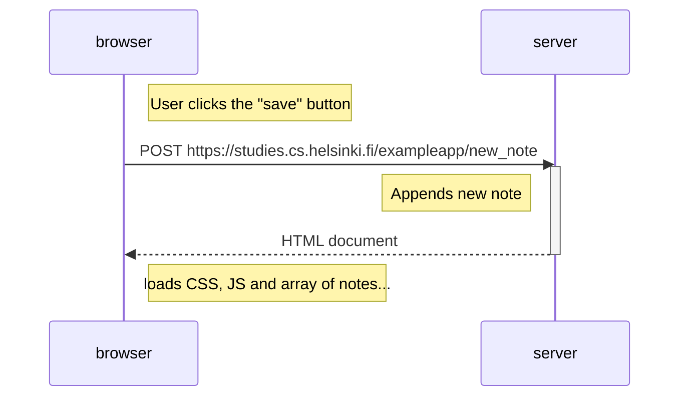

# Submitting a new note

```mermaid
sequenceDiagram
  participant browser
  participant server
  
  Note right of browser: User clicks the "save" button
  browser->>server: POST https://studies.cs.helsinki.fi/exampleapp/new_note
  
  activate server
  Note left of server: Appends new note
  server-->>browser: HTML document
  deactivate server
  
  Note right of browser: loads CSS, JS and array of notes...
```
