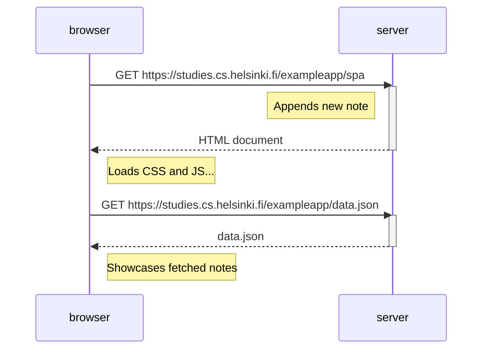

# Requesting SPA

```mermaid
sequenceDiagram
  participant browser
  participant server
  
  browser->>server: GET https://studies.cs.helsinki.fi/exampleapp/spa
  
  activate server
  Note left of server: Appends new note
  server-->>browser: HTML document
  deactivate server
  
  Note right of browser: Loads CSS and JS...
  browser->>server: GET https://studies.cs.helsinki.fi/exampleapp/data.json
  
  activate server
  server-->>browser: data.json
  deactivate server
  
  Note right of browser: Showcases fetched notes
```
